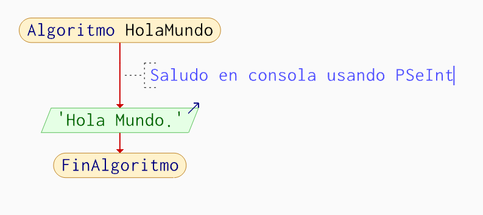

# Logic & Algorithms with PSeInt
**Date:** 2025-11-27
**Tags:** #PSeInt #Logic #Algorithms #Flowchart
**Back to ->** [README](../README.md)
## Writing the First Algorithm
The "Hello World" program is the traditional starting point to verify that the development environment is set up correctly.

### Example: "Hola Mundo" Console Output
The following algorithm demonstrates the basic structure of a PSeInt program and uses the `Escribir` command to send text to the console.

*(Figure 1: PSeInt pseudocode for "Hola Mundo")*

> **Pro Tip:** Use the shortcut `Ctrl + N` to quickly create a new file in PSeInt.

---

## Visualizing Logic: Flowcharts
A powerful feature of PSeInt is the ability to generate a visual representation of the algorithm's logic. In English, this is called a **Flowchart**.

### Viewing the Flowchart
Click the diagram icon in the toolbar to generate the flowchart for the current algorithm.

*(Figure 2: Flowchart representation of the "Hola Mundo" algorithm)*

This visual aid is crucial for understanding how the program's execution flows sequentially from "Algoritmo" to "FinAlgoritmo".

**Next Step ->** [Introduction to Programming Logic](./Introduction-to-Programming-Logic.md)
